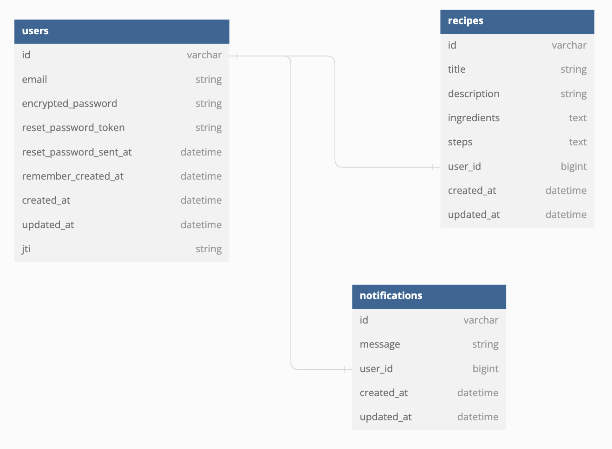

# README

## Recipe Sharing

This application is a RoR API to allow users to upload, share, and interact with recipes.

## Requirements

- Ruby: version 3.0.1
- Rails 7

## Getting started

- fork & clone
- `bundle install`
- `rails db:create db:migrate db:seed`
- `rails s`

## Entity Relationship Diagram



## API Endpoints

### Authentication

| Verb   | URI Pattern            | Controller#Action     |
|--------|------------------------|-----------------------|
| POST   | `/api/v1/signup`       | `users#registrations` |
| POST   | `/api/v1/login`        | `users#sessions`      |
| DELETE | `/api/v1/logout`       | `users#sessions`      |

#### POST /api/v1/signup

Request:

```sh
curl http://localhost:3000/api/v1/signup \
  --include \
  --request POST \
  --header "Content-Type: application/json" \
  --data '{
    "api_v1_user": {
      "email": "example1@gmail.com",
      "password": "12345678"
    }
  }'
```

Response:

```md
HTTP/1.1 200 OK
Content-Type: application/json; charset=utf-8

{
  "status":
    {
      "code":200,
      "message": "Signed up successfully."
    },
  "data":
    {
      "id": 5,
      "email": "example1@gmail.com"
    }
}
```

#### POST /api/v1/login

Request:

```sh
curl http://localhost:3000/api/v1/login \
  --include \
  --request POST \
  --header "Content-Type: application/json" \
  --data '{
    "api_v1_user": {
        "email": "example1@gmail.com",
        "password": "12345678"
    }
  }'
```

Response:

```md
HTTP/1.1 200 OK
Content-Type: application/json; charset=utf-8
Authorization: Bearer <LOGIN_TOKEN>

{
  "status": {
    "code": 200,
    "message": "Logged in successfully.",
    "data": {
      "user": {
          "id": 5,
          "email": "example1@gmail.com"
      }
    }
  }
}
```

#### DELETE /api/v1/logout

Request:

```sh
curl http://localhost:3000/api/v1/logout \
  --include \
  --request DELETE \
  --header "Authorization: <LOGIN_TOKEN>" \
  --data '{
    "api_v1_user": {
        "email": "example1@gmail.com",
        "password": "12345678"
    }
  }'
```

Response:

```md
HTTP/1.1 200 OK

{
    "status": 200,
    "message": "Logged out successfully."
}
```


### Recipes

| Verb   | URI Pattern            | Controller#Action |
|--------|------------------------|-------------------|
| GET    | `/api/v1/recipes`      | `recipes#index`   |
| POST   | `/api/v1/recipes`      | `recipes#create`  |
| PATCH  | `/api/v1/recipes/:id`  | `recipes#update`  |

#### GET /api/v1/recipes

```sh
curl http://localhost:3000/api/v1/recipes \
  --include \
  --request GET \
  --header "Authorization: <LOGIN_TOKEN>"
```

Response:

```md
HTTP/1.1 200 OK
Content-Type: application/json; charset=utf-8
[
  {
      "id": 1,
      "title": "Chicken Cacciatore",
      "description": "A classic Italian dish",
      "ingredients": "Chicken, Parmesan, Cacciatore Sauce",
      "steps": "Bread chicken, fry chicken, add sauce and cheese, bake",
      "user_id": 1,
      "created_at": "2023-11-27T21:36:43.819Z",
      "updated_at": "2023-11-27T21:36:47.315Z"
  },
  {
      "id": 2,
      "title": "Chicken Cacciatore",
      "description": "A classic Italian dish",
      "ingredients": "Chicken, Parmesan, Cacciatore Sauce",
      "steps": "Bread chicken, fry chicken, add sauce and cheese, bake",
      "user_id": 1,
      "created_at": "2023-11-27T21:37:53.375Z",
      "updated_at": "2023-11-27T21:37:55.996Z"
  },
  ...
]
```

#### POST /api/v1/recipes

```sh
curl http://localhost:3000/api/v1/recipes \
  --include \
  --request POST \
  --header "Content-Type: application/json" \
  --header "Authorization: <LOGIN_TOKEN>" \
  --data '{
    "recipe": {
        "title": "Chicken Cacciatore",
        "description": "A classic Italian dish",
        "ingredients": "Chicken, Parmesan, Cacciatore Sauce",
        "steps": "Bread chicken, fry chicken, add sauce and cheese, bake",
        "image": "BASE64_IMAGE",
      }
    }'
```

Response:

```md
HTTP/1.1 201 Created
Content-Type: application/json; charset=utf-8
{
  "id": 17,
  "title": "Chicken Cacciatore",
  "description": "A classic Italian dish",
  "ingredients": "Chicken, Parmesan, Cacciatore Sauce",
  "steps": "Bread chicken, fry chicken, add sauce and cheese, bake",
  "user_id": 1,
  "created_at": "2023-11-28T13:48:02.629Z",
  "updated_at": "2023-11-28T13:48:02.629Z"
}
```

#### PATCH /api/v1/recipes/:id

```sh
curl http://localhost:3000/api/v1/recipes/1 \
  --include \
  --request PATCH \
  --header "Content-Type: application/json" \
  --header "Authorization: <LOGIN_TOKEN>" \
  --data '{
    "recipe": {
        "title": "Changed title"
    }
  }'
```

Response:

```md
HTTP/1.1 200 OK
Content-Type: application/json; charset=utf-8
{
  "id": 1,
  "title": "Changed title",
  "description": "A classic Italian dish",
  "ingredients": "Chicken, Parmesan, Cacciatore Sauce",
  "steps": "Bread chicken, fry chicken, add sauce and cheese, bake",
  "user_id": 1,
  "created_at": "2023-11-27T21:36:43.819Z",
  "updated_at": "2023-11-28T13:58:02.629Z"
}
```
